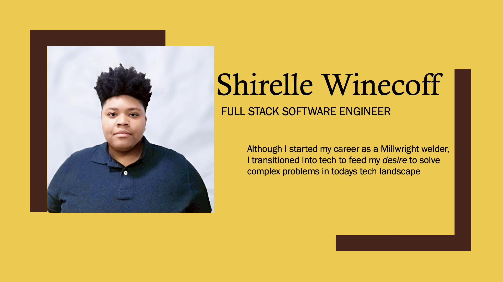

# Multiverse Final Portfolio

Here is a brief collection of projects that I've worked on during my time as a Multiverse software engineering apprentice.

## Overview

While a Multiverse apprentice working at American Express, I delivered value through improving and adding functionality to exisiting code bases while implementing Amex's blue box values of leadership, integrity, hardwork. Most of my work was focused on improving our customer service portals- aiming to uplift user interfaces to broaden accessibility and minimize errors for customer service agents in order to continue our history of delivering great and unmatched serivce to our customers. 

Although I cannot include code directly from our modules in this portfolio due to security, I will share some personal projects that strengthened my skills as a web developer and allowed me to implement what I learned into my work at Amex. 

## Durable Skills

- Problem solving
- Effective communication
- Delivering products on time
- Initiative Taking 
- Knowledge & upskilling through collabortion

## Projects

My projects are seperated into the following categories: 

- Backend using Java and a framework (DOGS)
- Frontend using third party API and complex state management (Store-Frontend-App)
- Fullstack App (SNKRS)

As a way to show my initiative to learning new technologies and branches of software development, I also included a project I worked on as a fellow of Correlation One's Data Science 4 All program titled PPP-loan-evaluation. This project was undertook with the goal of building a data warehouse a potention data analyst could use to draw conclusions from the effectiveness of the PPP loan program implemented during the COVID pandemic. 

## Contact

Shirelle Winecoff / shirellewinecoffm@gmail.com / (862) 380-1664

## !!!View My Resume!!!

It is apart of this repository in the main branch

## Acknowledgements

I would like to thank the whole Multiverse team, especially my cohort's instructor Jonathan. He has helped all of us blossom into the capable developers we are today. 

I would also like to thank the CVP team at Amex. From onboarding to completing my last story with them, they helped me understand the intracies of development and showed me tips and tricks to making my development process more efficient. 

Lastly, I want to shout out my Multiverse cohort of 2023! We supported each other greatly and when we needed help, we were there to coach each other and got to colloborate and work on some cool projects. 

Thank you to American Express and Multiverse for providing me with such a great opportunity! Without them, I wouldn't have been able to go from a welder to a software developer. 
